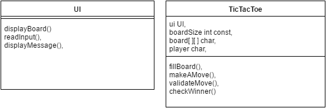

# Design report

### Initial Design
We started by thinking of what classes are necessary for out project.
Due to the small size of the project we decided that we only need two classes. The TicTacToe class has all the logic and the UI class has all the input/output functionality.
The UI class can easily be changed to support a WebUI or any other UI.

### Class Diagram

